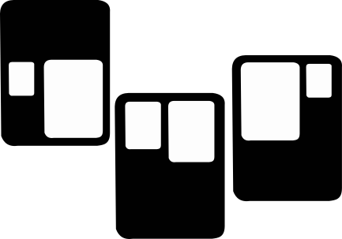

# chroneon
A web app dashboard to record and train models to predict gestures from EMG signals.

# Purpose
This shiny web application is intended to provide a user friendly experience for researchers
using EMG (or any other time series signals) for classification purposes.

# Recording

# Predicting

